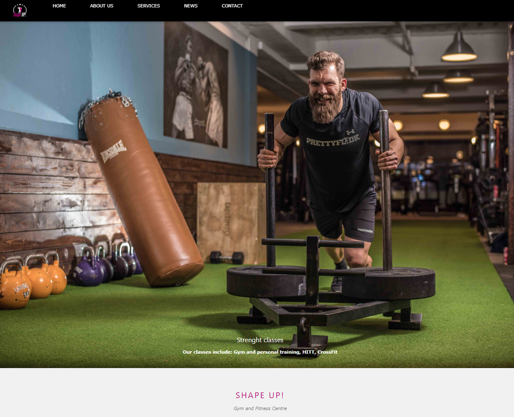

# Michael Szwedo - portfolio
> Below you can find information about my web site named index.html. It was created to present a few of my web projects, information about me and contact information. 

## Table of contents
* [General info](#general-info)
* [Screenshots](#screenshots)
* [Technologies](#technologies)
* [Setup](#setup)
* [Features](#features)
* [Status](#status)
* [Contact](#contact)

## General info
My Main website was created to show a few of my web projects, information about me and contact information.
On my main page, all graphics are created by myself. On my other websites, I've been using graphics and photos what I've made by myself as well as pictures from photos bank.
All that you see in the main page was created by self including the main page too. The pages were created using HTML, CSS, JavaScript. They don't have back-end (PHP, SQL, etc. files)

Projects called "T-Rex- Hockey Store" and "Shape Up! Gym and Fitness Centre" are imaginary company websites. 
The purpose of the project is presenting my visual and coding skills. Websites are without back-end. They were created using HTML, CSS and JavaScript. 

The "Pure CSS illustration was created during "Hackathon" and was focused on CSS, especially on transforms, transition and animation in CSS. The page is without responsivity. It was created using only HTML, CSS.

The last project called "Joanna Kruszynska-Szwedo - violinist" is my wife website what I've created for her. It is not coding myself, 
it was created using a template from "wixsite". Website content and design (graphics, photos, music, movie) was created by myself.

I have strong motivation and I am focused and concerned on Design and Develop Websites, as well as a Web Application and software development process, I have a lot of ideas about websites and applications. I am constantly improving my knowledge about user interface design and coding development and all that is related to Information Technology. 

## Screenshots

## Technologies
* HTML5
* CSS3
* JavaScript
* Jquery 3.3.1
* Bootstrap v3.4.0 
* Google fonts
* Cdnjs fonts 

## Setup
Link to the main webpage: https://michaelszwedo.github.io/mainpage/ if you want to see how the page looks.
The main page include all files (HTML, CSS, jpg, png) what I used to prepare the websites.

## Features
List of features ready and TODOs for future development. Information about individual files used to each project

* _Main site_ was created to show a few of my web projects, information about me and contact information. It is a one-page website created using HTML, CSS and JS. The page is responsive, and suit to widescreen TVs, desktops, laptops, mobile types of equipment and smartphones.
  Include files: index.html and style.css, footer_lodyas.png, logoname.png, main-picture.jpg.

* _T-rex Hockey store_ is imaginary company website. It was created using: HTML, CSS, js, bootstrap, jquery and fonts from google and cdnjs. The page is responsive, and suit to widescreen TVs, desktops, laptops, mobile types of equipment and smartphones. Project include graphics and photos what I've made by myself as well as pictures from photos bank. 
 The pages are without back-end. 
 Filename: shop.html it's the main page of the T-Rex Hockey Store.
 Other files: "HTML" - contact, deals, login, change pass, reset pass, form, player, goalie, inline, a product files with a number, error. "CSS"- has the same name as HTML files. Files named from 01 to 35, and named player, goalie, inline, skate, hockey shop, gift card, map, DinoOnIce, main logo, mainlogored, mianlogogreen are a jpg and png files. 

* _Shape Up! Gym and Fitness Centre_ is an imaginary company website. It was created using: HTML, CSS, js, and fonts from google and cdnjs. The page is responsive, and suit to widescreen TVs, desktops, laptops, mobile types of equipment and smartphones. Project include graphics and photos what I've made by myself as well as pictures from photos bank. 
 The pages are without back-end. 
 The file named: index_shape_up.html it's the main page of the Gym and Fitness Centre.
 Other files: name_shape_up with.html and name_shape_up with.css"  Graphics files .jpg and .png files are also included. 

* _The "Pure CSS illustration_ was created during "Hackathon" and was focused on CSS, especially on transforms, transition and animation in CSS. The page is without responsivity. It was created using only HTML, CSS.
File named: purecss.html and pure.css are the files from that project
 
* _"Joanna Kruszynska-Szwedo - violinist"_ it is a website created using a template from "wixsite". It doesn't include HTML, CSS and js code.
It presents some kind of sense of design. Website content and design (graphics, photos, music, movie) was created by myself.

To-do list:

* Improve project: Pure CSS Illustration to responsive website

## Status
* The main site is: in _progress_ because I am going to add new projects.
* T-rex Hockey store is _finished_
* Shape Up! Gym and Fitness Centre is _finished_
* Pure CSS Illustration is: _in progress_ because I am going to modify a file and add responsivity 
* Joanna Kruszynska-Szwedo - violinist is _finished_

## Contact
Created by [@michaelszwedo] (https://www.github.com/michaelszwedo) - feel free to contact me!

